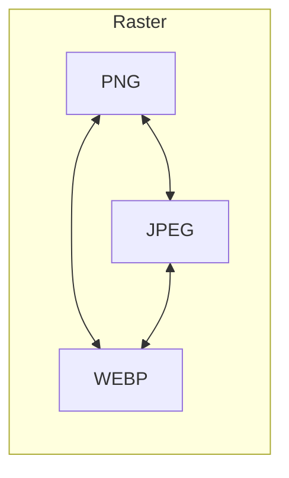
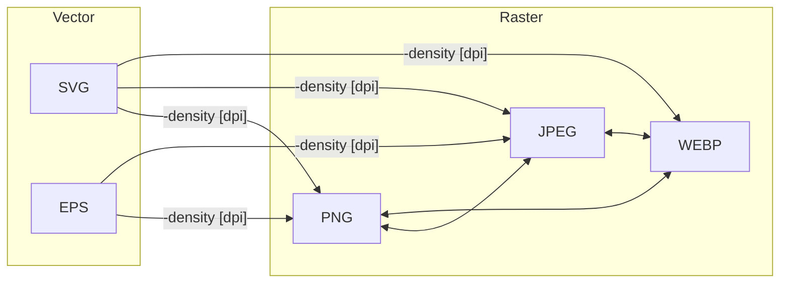

# converter

A universal file converter.

Implemented formats:

```mermaid
graph LR;
    subgraph Raster
        PNG;
        JPEG;
        WEBP;
    end

    PNG <--> JPEG;
    PNG <--> WEBP;
    JPEG <--> WEBP;

    click PNG "https://en.wikipedia.org/wiki/Portable_Network_Graphics" "PNG Details"
    click JPEG "https://en.wikipedia.org/wiki/JPEG" "JPEG Details"
    click WEBP "https://en.wikipedia.org/wiki/WebP" "WEBP Details"
```

Roadmap:

```mermaid
graph LR;
    subgraph Raster
        PNG;
        JPEG;
        WEBP;
    end

    subgraph Vector
        SVG;
        EPS;
    end

    PNG <--> JPEG;
    PNG <--> WEBP;
    JPEG <--> WEBP;

    SVG -- "-density [dpi]" --> PNG;
    SVG -- "-density [dpi]" --> JPEG;
    SVG -- "-density [dpi]" --> WEBP;
    EPS -- "-density [dpi]" --> PNG;
    EPS -- "-density [dpi]" --> JPEG;

    click PNG "https://en.wikipedia.org/wiki/Portable_Network_Graphics" "PNG Details"
    click JPEG "https://en.wikipedia.org/wiki/JPEG" "JPEG Details"
    click WEBP "https://en.wikipedia.org/wiki/WebP" "WEBP Details"
    click SVG "https://en.wikipedia.org/wiki/Scalable_Vector_Graphics" "SVG Details"
    click EPS "https://en.wikipedia.org/wiki/Encapsulated_PostScript" "EPS Details"
```
